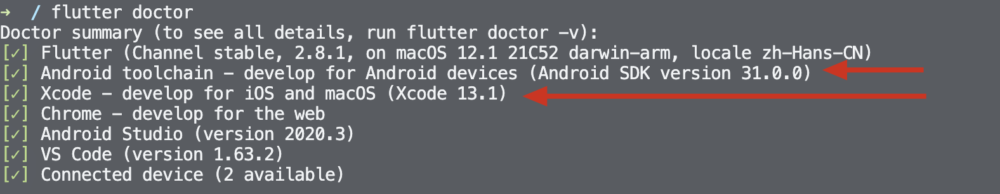
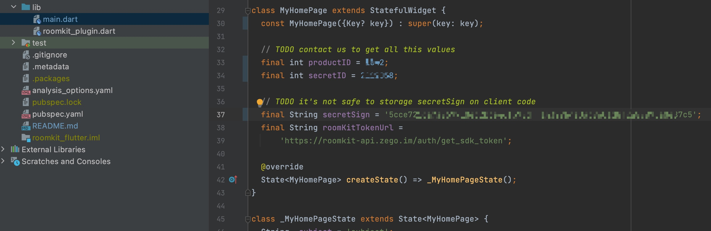
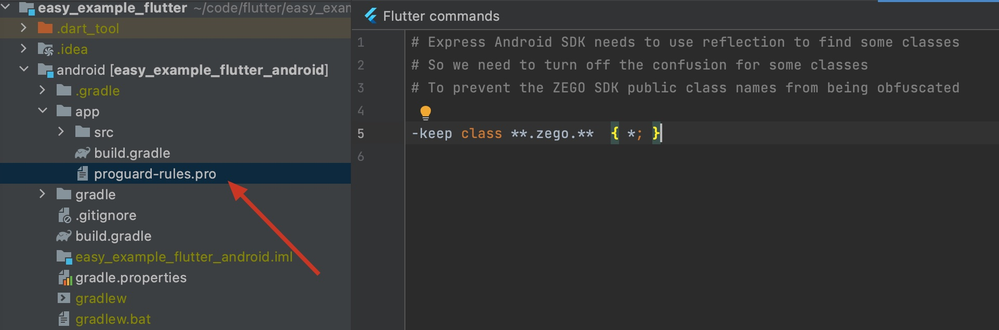
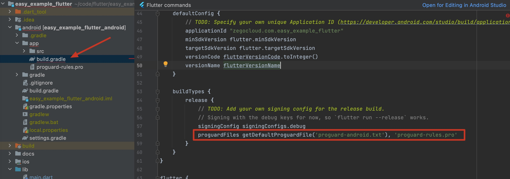
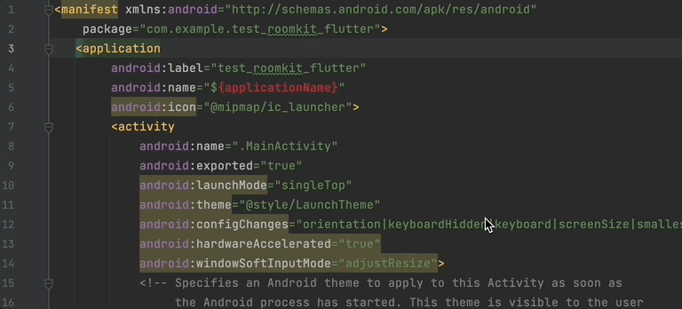

# ZEGOCLOUD RoomKit Flutter
RoomKit Flutter is a wrapper of Native Android and iOS `RoomKit SDK`

## Getting started

### Prerequisites

#### Basic requirements

* [Android Studio 2020.3.1 or later](https://developer.android.com/studio)
* [Flutter SDK](https://docs.flutter.dev/get-started/install)
* Create a project in [ZEGOCLOUD Admin Console](https://zegocloud.com/). For details, see [Admin Console - Project management](https://docs.zegocloud.com/article/1271).

The platform-specific requirements are as follows:

#### To build an Android app:

* Android SDK packages: Android SDK 30, Android SDK Platform-Tools 30.x.x or later.
* An Android device or Simulator that is running on Android 4.1 or later and supports audio and video. We recommend you use a real device (Remember to enable **USB debugging** for the device).

#### To build an iOS app(NOT SUPPORT NOW!!!):

* [Xcode 7.0 or later](https://developer.apple.com/xcode/download)
* [CocoaPods](https://guides.cocoapods.org/using/getting-started.html#installation)
* An iOS device or Simulator that is running on iOS 13.0 or later and supports audio and video. We recommend you use a real device.

#### Check the development environment

After all the requirements required in the previous step are met, run the following command to check whether your development environment is ready:

```
$ flutter doctor
```


* If the Android development environment is ready, the **Android toolchain** item shows a ready state.
* If the iOS development environment is ready, the **Xcode**  item shows a ready state.

### Run the sample code

1. Open the `roomkit_flutter` project in Android Studio.
2. Make sure the **developer mode** and **USB debugging** are enabled for the Android device, and connect the Android device to your computer.
3. If the **Running Devices** box in the upper area changes to the device name you are using, which means you are ready to run the sample code.
4. Contact us to get the SecretID, SecretSign and ProductID.
   
5. Run `flutter pub get` on terminal
6. Run the sample code on your device to experience the `roomkit_flutter`.

## Integrate the SDK into your project

### Turn off some classes's confusion

To prevent the ZEGO SDK public class names from being obfuscated, please complete the following steps:

1. Create `proguard-rules.pro` file under [your_project > android > app] with content as show below:
```
-keep class **.zego.**  { *; }
```


2. Add config code to `android/app/build.gradle` for release build:
```
proguardFiles getDefaultProguardFile('proguard-android.txt'), 'proguard-rules.pro'
```



### Copy source code to your project

Copy `roomkit_plugin.dart` file to [your_project > lib] folder.

Copy `RoomKitPlugin.kt` file to where [MainActivity.kt] is located.

Copy `libs` folder to [your_project > android > app] folder.

### Change code configuration

#### Add `configureFlutterEngine` method to MainActivity
```kotlin
...
import com.zegocloud.roomkit_flutter.RoomKitPlugin
import io.flutter.embedding.android.FlutterActivity
import io.flutter.embedding.engine.FlutterEngine
import io.flutter.plugin.common.MethodChannel
...

class MainActivity: FlutterActivity() {
  ...

    override fun configureFlutterEngine(flutterEngine: FlutterEngine) {
        super.configureFlutterEngine(flutterEngine)

        val pluginHandler = RoomKitPlugin()

        val messenger = flutterEngine.dartExecutor.binaryMessenger
        val channel = MethodChannel(messenger, "RoomKitPlugin")

        channel.setMethodCallHandler { call, result ->
            when(call.method) {
                "init" -> { pluginHandler.init(call, result, application) }
                "joinRoom" -> { pluginHandler.joinRoom(call, result, this@MainActivity) }
                "getDeviceID" -> { pluginHandler.getDeviceID(call, result) }
                else -> { result.error("error_code", "error_message", null) }
            }
        }
    }
```

#### Add config to `[android > app > src > main > AndroidManifest.xml]`
```xml
<manifest xmlns:android="http://schemas.android.com/apk/res/android"
    xmlns:tools="http://schemas.android.com/tools" <!-- add this line -->
    ...
   <application
       tools:replace="android:label" <!-- add this line -->
       ...
```



#### Change `minSdkVersion` to 21 on `[android > app > build.gradle]`
```gradle
    defaultConfig {
        ...
        minSdkVersion 21
        ...
    }
```

#### Add dependencies to `[android > app > build.gradle]`
```gradle
dependencies {
    ...

    implementation "androidx.core:core-ktx:1.3.0"
    implementation 'com.squareup.okhttp3:okhttp:4.0.1'
    api fileTree(include: ['*.jar', '*.aar'], dir: 'libs')
    api "com.google.android.material:material:1.1.0"
    api "com.google.code.gson:gson:2.8.6"
    api "com.tencent.imsdk:imsdk:5.1.56"
    api "androidx.swiperefreshlayout:swiperefreshlayout:1.1.0"
    implementation "androidx.constraintlayout:constraintlayout:2.1.1"
}
```

### Add config to `[android > build.gradle]`
```gradle
buildscript {
    ...
    repositories {
        ...
        maven { url 'https://www.jitpack.io' } // Add this line
    }
...
}

allprojects {
    repositories {
        ...
        maven { url 'https://www.jitpack.io' } // Add this line
    }
}
```

### Method call

The calling sequence of the SDK interface is as follows:
init --> joinRoom

#### init

Before using the SDK function, you need to init the SDK first. We recommend init on application startup. The sample code is as follows:

```js
class _MyHomePageState extends State<MyHomePage> {

  @override
  void initState() {
    RoomKitPlugin.init(widget.secretID).then((value) {
      print('SDK initialized');
    });
    super.initState();
  }
```

#### Join room

When you are ready to start a class, then you can call `joinRoom` to create or join in a class room.

```js
TextButton(
    onPressed: () {
      getRoomKitToken().then((roomkitToken) {
        ZegoJoinRoomConfig config = ZegoJoinRoomConfig(
            _userID,
            _userName,
            roomkitToken,
            widget.productID,
            _roomID,
            _role);
        RoomKitPlugin.joinRoom(config, _subject).then((value) {
          print(value);
        });
      });
    },
    child: const Text('Join Room'))
```
